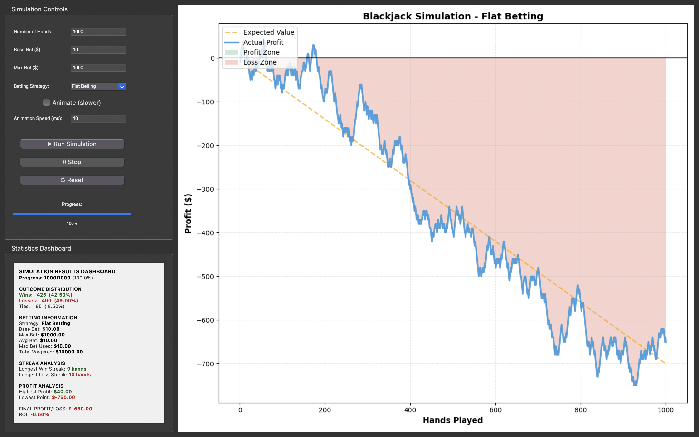
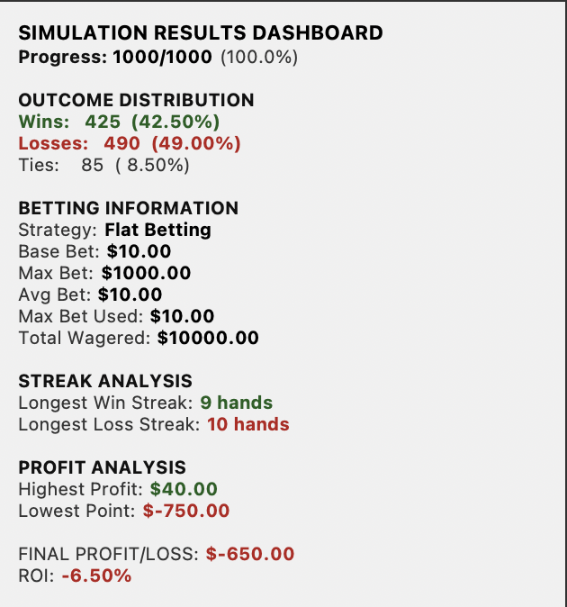

# Blackjack Strategy Simulator

A comprehensive Python-based blackjack betting strategy simulator with real-time visualization and statistical analysis. Test different betting strategies and see how they perform over thousands of hands.

I started this project with the goal of creating a simple program to show my roommates that they cant win playing blackjack. The initial program didn't take longer than an hour to write, when I showed my roommates they started talking about the different strategies they can use to beat the house. From this, I implemented the basic strategies that are used, and added a gui so that they can play around with the program.

Building this project made me more comfortable in designing entire projects start to finish. Because I had to rewrite many portions of the program as I kept expanding what it could do, I learned a lot about code structure and best practices. Integrating Tkinter and Matplotlib helped me understand how to create responsive, real-time interfaces and how to visualize data effectively. Through debugging and refining features like the expected value line and streak tracking, I improved my problem-solving and analytical thinking. Most importantly, this project showed how software can model complex, chance-based systems in an engaging and informative way.

If I were to revisit this project in the future I might add:
 - Add monte carlo simulations
 - Add actual blackjack, with a shoe and cards, to truely simulate each hand instead of just the odds
 - Add card counting



## Features

### Multiple Betting Strategies
- **Flat Betting**: Consistent bet size every hand (control baseline)
- **Martingale**: Double your bet after each loss, reset after win
- **Fibonacci**: Follow the Fibonacci sequence after losses
- **Paroli**: Double after wins (positive progression system)
- **Progressive**: Gradual bet adjustment based on win/loss streaks

### Real-Time Visualization
- **Interactive Profit/Loss Chart**: Watch your strategy work in real time
- **Expected Value Line**: Compare actual results against mathematical expectation
- **Color-Coded Zones**: Green for profit, red for losses

### Comprehensive Statistics Dashboard



Track everything that matters:
- **Outcome Distribution**: Win/loss/tie percentages (Will converge to a 42% win rate)
- **Betting Information**: Average bet, max bet used, total wagered
- **Streak Analysis**: Longest winning and losing streaks
- **Profit Analysis**: Highest profit, worst drawdown, final P&L
- **ROI Calculation**: Return on investment percentage (Calculated from total amount bet)

### Simulation Controls
- **Instant Mode**: Run thousands of hands instantly
- **Animated Mode**: Watch the simulation unfold in real-time
- **Adjustable Speed**: Control animation speed (1-1000ms per update)
- **Progress Tracking**: Visual progress bar with percentage
- **Pause**: Stop the simulation at any time

## Quick Start

### Prerequisites
```bash
Python 3.7+
numpy
matplotlib
tkinter
```

### Installation
```bash
# Clone the repository
git clone https://github.com/VictorMorris/BlackjackSimulation
cd BlackjackSimulation

# Install dependencies
pip install numpy matplotlib

# Run the application
python main.py
```

### Basic Usage
1. **Configure Parameters**
   - Set number of hands
   - Choose base bet amount ($1+)
   - Set maximum bet limit (the table limit)
   
2. **Select Strategy**
   - Pick from 5 different betting strategies
        - Flat Betting
        - Martingale
        - Fibonacci
        - Paroli
        - Progressive
   
3. **Run Simulation**
   - Click "Run Simulation"
   - Toggle "Animate" to watch each hand individually
   
4. **Analyze Results**
   - View statistics dashboard
   - Examine profit/loss chart
   - Compare against expected value

## Understanding the Results

### Expected Value Line (Orange Dashed)
Represents the theoretical loss based on house edge (-7% in this simulation). Over time, all strategies should trend toward this line due to the mathematical disadvantage.

### Profit Zones
- **Green shading**: Times when you're in profit
- **Red shading**: Times when you're down
- The wider the swings, the riskier the strategy

### ROI (Return on Investment)
Shows your net profit/loss as a percentage of total money wagered. Useful for comparing strategies with different bet sizes.

## Project Structure

```
src/
├── main.py              # Application entry point
├── constants.py         # Game configuration and constants
├── strategies.py        # Betting strategy implementations
├── simulator.py         # Core simulation engine
├── gui.py               # Tkinter GUI implementation
```

### Module Responsibilities

**`constants.py`**
- Game probabilities (win/loss/tie)
- Expected value calculations
- Default UI values
- Configuration settings

**`strategies.py`**
- `BettingStrategy` base class
- Five strategy implementations
- Bet calculation logic

**`simulator.py`**
- `BlackjackSimulator` class
- Hand simulation logic
- Statistics tracking
- History management

**`gui.py`**
- `BlackjackGUI` class
- UI layout and controls
- Matplotlib chart integration
- Event handlers

**`main.py`**
- Simple entry point
- Creates Tkinter root window
- Initializes application

## Educational Value

This simulator is excellent for:
- **Understanding Betting Systems**: See why systems don't beat house edge
- **Risk Management**: Visualize variance and drawdown potential

## Important Notes

### House Edge
The simulation uses these probabilities which are the most common odds that are found at a blackjack table:
- Win: 49%
- Loss: 42%
- Tie: 9%

This creates a **-7% expected value**, meaning the house has a 7% edge. Over enough hands, all strategies will lose approximately 7% of total money wagered.

## Customization

### Adding New Strategies
1. Open `strategies.py`
2. Create a new class inheriting from `BettingStrategy`
3. Implement `get_bet_amount()` method
4. Implement `get_name()` method
5. Add to the strategies dictionary in `gui.py`

```python
class MyCustomStrategy(BettingStrategy):
    def get_bet_amount(self, base_bet, current_streak, total_profit, hand_number, max_bet):
        # Your logic here
        return min(calculated_bet, max_bet)
    
    def get_name(self):
        return "My Custom Strategy"
```

### Adjusting Probabilities
Edit values in `constants.py`:
```python
WIN_PROBABILITY = 0.49
LOSS_PROBABILITY = 0.42
TIE_PROBABILITY = 0.09
EXPECTED_VALUE_PER_DOLLAR = -0.07
```
